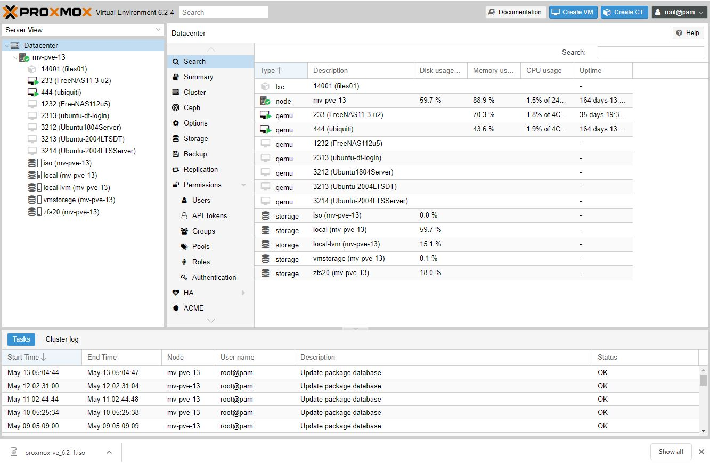
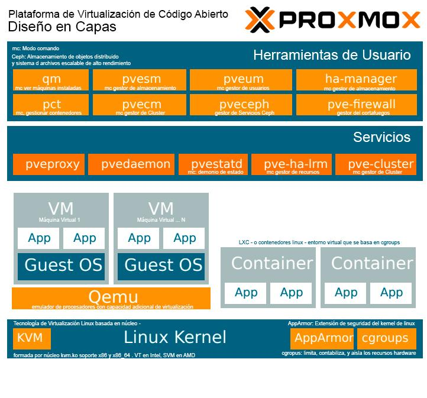

# Módulo 1: Introducción a Proxmox VE

## ¿Qué es Proxmox VE?
Proxmox Virtual Environment (Proxmox VE) es una plataforma de virtualización de código abierto basada en Debian, que permite gestionar máquinas virtuales (KVM) y contenedores (LXC) desde una interfaz web intuitiva.

---

## Características principales
- Virtualización con KVM y LXC
- Interfaz web completa
- Gestión de almacenamiento (ZFS, LVM, NFS, etc.)
- Snapshots y backups
- Alta disponibilidad (HA)
- Clústeres y migración en vivo
- Integración con Ceph y otros sistemas distribuidos

---

## Requisitos del sistema
- CPU compatible con virtualización (Intel VT-x o AMD-V)
- Mínimo 2 GB de RAM (recomendado 8 GB o más)
- Disco duro de al menos 32 GB
- Conectividad de red

---

## Casos de uso
- Laboratorios educativos
- Entornos de desarrollo y pruebas
- Servidores de producción
- Formación en ciberseguridad y administración de sistemas

---

Este módulo proporciona una visión general de Proxmox VE y sus capacidades como plataforma de virtualización.
