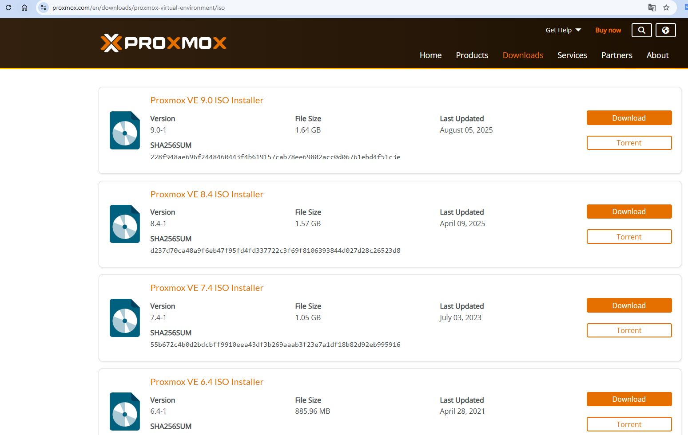

# Módulo 2: Instalación de Proxmox VE

## 1. Descarga de la ISO oficial
Visita el sitio oficial de Proxmox para descargar la última versión:
[https://www.proxmox.com/en/downloads](https://www.proxmox.com/en/downloads)



---

## 2. Preparación del USB booteable
Utiliza herramientas como **Rufus** o **BalenaEtcher** o **Ventoy** para crear un USB booteable.


---

## 3. Instalación paso a paso
Arranca el servidor desde el USB y sigue los pasos del instalador:
- Selección del disco
- Configuración regional
- Contraseña de root
- Configuración de red


---

## 4. Primer acceso vía navegador
Accede a la interfaz web desde otro equipo:
```
https://IP_DEL_SERVIDOR:8006
```


---

## 5. Configuración inicial
- Aceptar certificado autofirmado
- Configurar almacenamiento y red
- Omitir suscripción si es necesario


---

## 6. Comandos útiles
```bash
apt update && apt upgrade
pveversion
systemctl status
reboot
```

---

Este módulo proporciona las bases para comenzar a trabajar con Proxmox VE en entornos educativos o de laboratorio.
